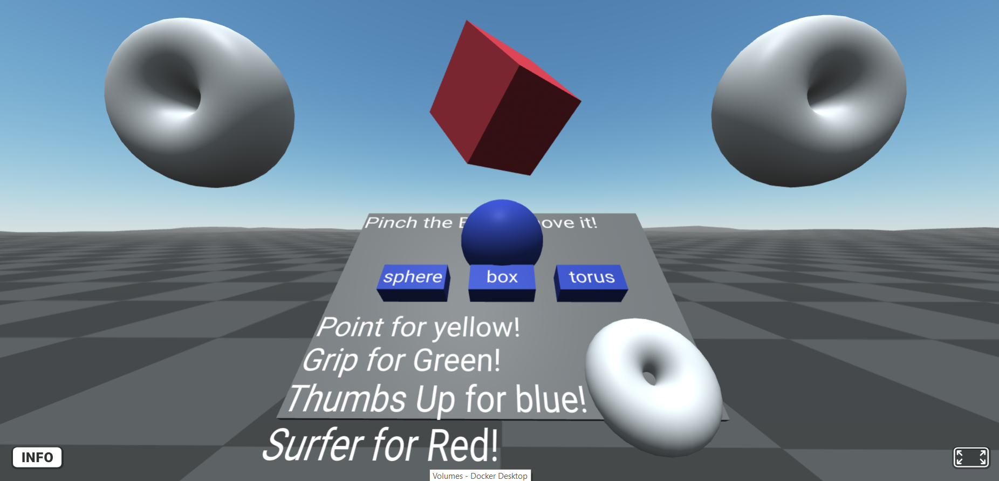

# Proyecto de Realidad Aumentada con A-Frame y Hand Tracking

## Captura de pantalla del Ejercicio

## Descripción del Proyecto

Este proyecto ha sido desarrollado como parte de nuestra asignatura de Desarrollo de Interfaces (DAD), con el objetivo de explorar y aplicar las capacidades de A-Frame a modo de primer contacto con no sólo A-Frame, sino con la tecnología 3D enfocada a la realidad expandida. Además, se nos encomendó aprende sobre la creación de experiencias inmersivas utilizando el seguimiento de manos (Hand Tracking).

## Trabajo Colaborativo

Siendo este proyecto una tecnología nueva para nosotros, sumado a la necesidad de compartir visores en clase, aun siendo una actividad de entrega individual nos juntamos en clase para comparar y compartir evoluciones de la escena virtual de cada. Además, junto a un compañero, decidimos invertir tiempo por la mañana para colaborar y profundizar en nuestro entendimiento de A-Frame.

## Funcionalidades Implementadas

- **Hand Tracking Básico:** Implementación exitosa del seguimiento de manos en A-Frame, basándonos en ejemplos preexistentes, apartado sencillo pues es una funcionalidad básica de los visores con los que trabajamos (MetaQuest2).
- **Funcionalidades Adicionales (Pinchable):** Incorporamos la funcion de **Pinchable** para mover objetos/entities de AFrame con una unica mano.
- **Interacciones Intuitivas:** Desarrollamos interacciones significativas con objetos virtuales, permitiendo acciones respondiendo adecuadamente a los gestos de la mano, como el **Señalar**, el **ThumbsUp**, el **Puño** y el **Shaka**(Saludo Surfero).

## Documentación y Comentarios

Hemos documentado claramente el código implementado, destacando las soluciones a los desafíos encontrados y explicando las decisiones de diseño que tomamos. Este enfoque no solo facilita la comprensión del proyecto por parte de terceros, sino que también sirve como recurso de aprendizaje para quienes estén interesados en el desarrollo de aplicaciones con A-Frame y Hand Tracking.

## Enlace al Proyecto

[Visita nuestro proyecto en GitHub](https://github.com/leogo22mz/AframeAttempt)

---

Aprender y desarrollar este proyecto nos permitió aplicar conocimientos teóricos previos, y también adquirir habilidades prácticas en el campo de la realidad virtual y aumentada, los cuales son ahora de los más emergentes y prometedores del mercado.
